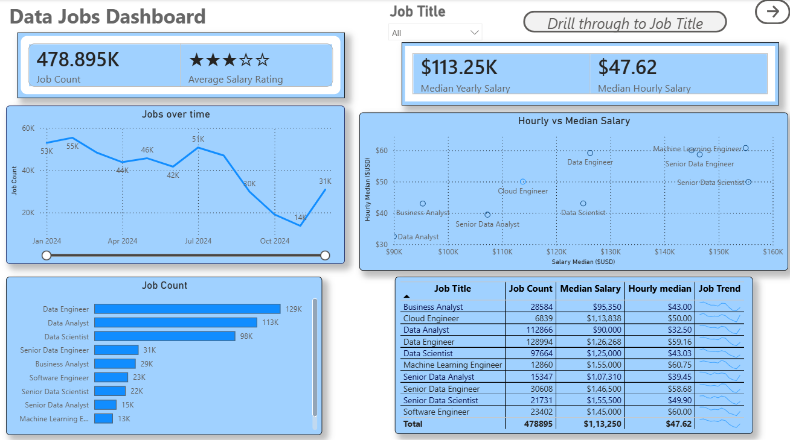
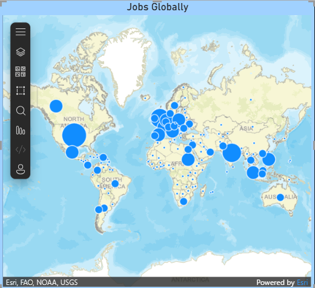
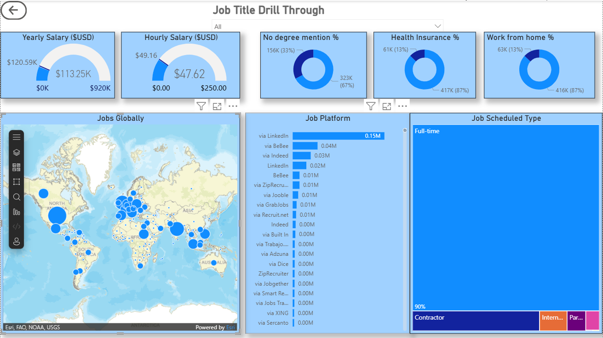

# Data Jobs Dashboard

Interactive Power BI dashboard analyzing global trends in the data jobs market using data visualization and business intelligence techniques.

---

## Project Overview

This dashboard was built to analyze:
- Job demand trends
- Salary distribution
- Geographic hiring patterns
- Job platform insights
- Work structure and employment types

The project focuses on transforming raw datasets into meaningful and actionable insights through interactive visualizations.

---

## Tools & Technologies

- Power BI
- Power Query
- DAX
- Data Cleaning
- Data Visualization

---

## Dashboard Features

- KPI Cards
- Interactive Filters
- Drill-through Analysis
- Geographic Job Mapping
- Salary Trend Analysis
- Platform Comparison
- Job Category Insights

---

## Dashboard Preview

### Main Dashboard

### Global Analysis

### Drill Through Analysis

---

## Learning Source

Concepts and workflow inspired by Luke Barousse’s Data Analyst Course.

---

## Files Included

| File | Description |
|---|---|
| `Project_1.pbix` | Main Power BI dashboard |
| `dataset.csv` | Dataset used for analysis |
| `Images/` | Dashboard screenshots |

---
 
## Requirements
 
- Power BI Desktop (free) — [download here](https://powerbi.microsoft.com/desktop)
- For the Esri map visual: an ArcGIS Maps for Power BI account (free tier available)
- No external data connection required — data is embedded in the `.pbix` file
---

## Key Learnings

- Building interactive dashboards
- Creating analytical layouts
- Using DAX for calculated insights
- Implementing drill-through navigation
- Improving visual storytelling

---

## Author

Utkarsh Yadav
